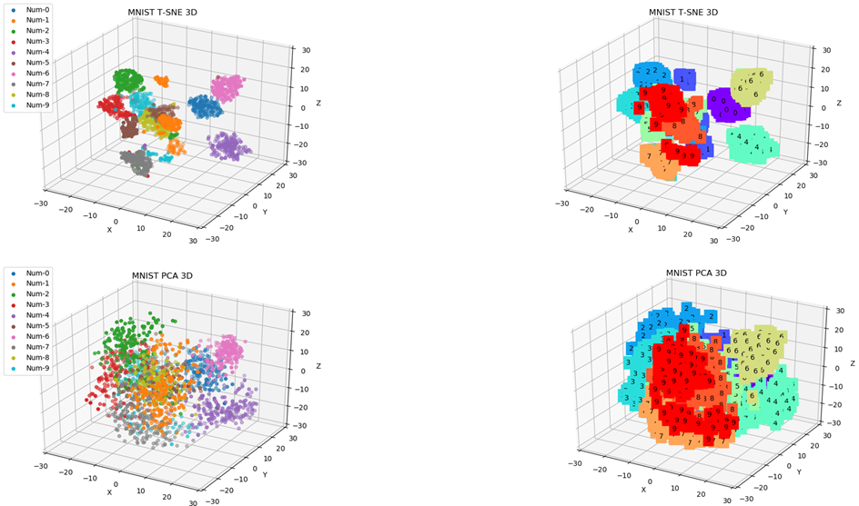

# Domain-Adaptation

[Progressive Domain Adaptation for Object Detection](https://arxiv.org/pdf/1910.11319.pdf)

[Borrow from Anywhere: Pseudo Multimodal Object Detection in Thermal Domain](http://arxiv.org/abs/1905.08789)

[SCL-Domain-Adaptive-Object-Detection](https://arxiv.org/abs/1911.02559)

## 3D对比

## 2D对比

## MMD

