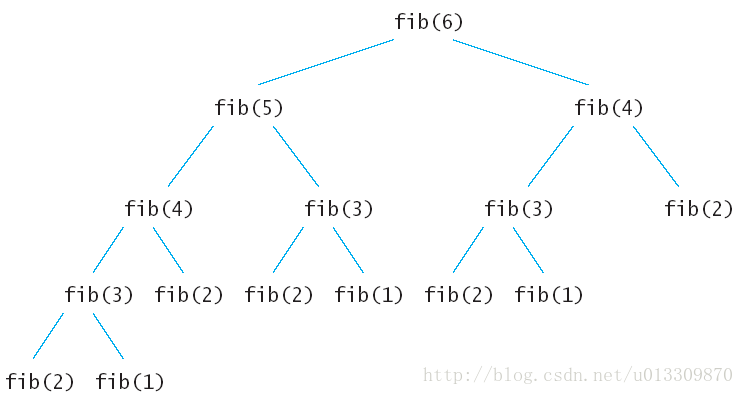

1. 算法的效率主要由以下两个复杂度来评估：

   * 时间复杂度：评估执行程序所需的时间。可以估算出程序对处理器的使用程度。大O表示
   * 空间复杂度：评估执行程序所需的存储空间。可以估算出程序对计算机内存的使用程度。

2. 二叉树第n层节点数最多为2^(n-1)个

3. 二叉树前序、中序、后序遍历的特性： 

   - 前序遍历： 
     ​    1.**访问根节点** 
     ​    2.前序遍历左子树 
     ​    3.前序遍历右子树 
     中序遍历： 
     ​    1.中序遍历左子树 
     ​    2.**访问根节点** 
     ​    3.中序遍历右子树 
     后序遍历： 
     ​    1.后序遍历左子树 
     ​    2.后序遍历右子树 
     ​    3.**访问根节点**

   - 确定根,确定左子树，确定右子树。

     在左子树中递归。

     在右子树中递归。

4. 冒泡排序,简单选择排序,堆排序,直接插入排序,希尔排序的**空间复杂度**为O(1),因为需要一个临时变量来交换元素位置 

   快速排序空间复杂度为O(log(n),因为递归调用了

   归并排序空间复杂是O(n),需要一个大小为n的临时数组.

   基数排序的空间复杂是O(n)

   桶排序的空间复杂度不确定

5. 动态规划

   通过把原问题分解为相对简单的子问题的方式求解复杂问题的方法

   ```python
   # 斐波拉契数列
   def Fib_DP(n):
       memo = [-1 for x in range(n+1)]
       memo[0] = 0
       memo[1] = 1
       for i in range(2,n+1):
           memo[i] = memo[i-1]+memo[i-2]
       return memo[n]
   ```

6. 斐波拉契数列

   

   

   ```python
   def Fib(n):
       if n <= 0:
           return 0
       elif n == 1:
           return 1
       else:
           return Fib(n-1)+Fib(n-2)
   ```

7. 二分查找

   二分查找的前提必须待查找的序列有序。

   ```python
   def Binary_Search(array,search_number):
       low = 0
       high = len(array)
       while low <= high:
           mid = (low + heigh)/2
           
           if array[mid] == serach_number:
               return mid
           # 中位数比搜索数大，搜索数在左边
           if array[mid] > serach_number:
               high = mid - 1
           # 查找右边
           else:
               low = mid + 1
       # 未找到
       return -1
       
   ```

8. Python中参数的传递本质

   Python中的函数通过引用传参(主要区分传值还是传引用)（传值是要把实参的值copy一份给形参作为值）

   **对于不可变对象作为函数参数，相当于C系语言的值传递** eg.int float tuple

   **对于可变对象作为函数参数，相当于C系语言的引用传递** eg.list dict

9. Python链表

   ```python
   class Node:
       def __init__(self, x):
           self.val = x
           self.next = None
   # 先定义一个一个节点       
   node1 = Node(1)
   node2 = Node(2)
   node3 = Node(3)
   # 每个节点的关系表示出来
   node1.next = node2
   node2.next = node3
   ```

   ```python
   # 链表节点的定义
   class ListNode(object):
       def __init__(self, data):
           self.data = data
           self.next = None
    
       def getData(self):
           return self.data
    
       def setData(self, newData):
           self.data = newData
    
       def getNext(self):
           return self.next
    
       def setNext(self, nextNode):
           self.next = nextNode
   # 无序链表
   class UnorderedList(object):
       def __init__(self):
           self.head = None
           self.tail = None
    
       def getHead(self):
           return self.head
    
       def isEmpty(self):
           return self.head is None and self.tail is None
    
       def add(self, item):
           node = ListNode(item)
           if self.isEmpty():
               self.head = self.tail = node
           else:
               node.next = self.head
               self.head = node   # the head is the most recently added node
    
       def size(self):
           current = self.head
           count = 0
           while current is not None:
               count += 1
               current = current.getNext()
    
           return count
    
       def search(self, item):
           current = self.head
           found = False
           while current is not None and not found:
               if current.getData() == item:
                   found = True
               else:
                   current = current.getNext()
           return found
    
       def append(self, item):
           node = ListNode(item)
           self.tail.setNext(node)
           self.tail = node
    
       def remove(self, item):
           current = self.head
           previous = None
           found = False
           while not found:
               if current.getData() == item:
                   found = True
               else:
                   previous = current
                   current = current.getNext()
    
           if current.getNext() is None:
               self.tail = previous
    
           if previous is None:
               self.head = current.getNext()
           else:
               previous.setNext(current.getNext())
   # 有序链表
   class OrderedList(object):
       def __init__(self):
           self.head = None
    
       def isEmpty(self):
           return self.head is None
    
       def search(self, item):
           stop = False
           found = False
           current = self.head
           while current is not None and not found and not stop:
               if current.getData() > item:
                   stop = True
               elif current.getData() == item:
                   found = True
               else:
                   current = current.getNext()
           return found
    
       def add(self, item):
           previous = None
           current = self.head
           stop = False
           while current is not None and not stop:
               if current.getData() >item:
                   stop = True
               else:
                   previous = current
                   current = current.getNext()
           node = ListNode(item)
           if previous is None:
               node.getNext(current)
               self.head = node
           else:
               previous.setNext(node)
               node.setNext(current)
   ```

10.Python栈stack

```python
# python内置的列表已经可以满足栈的要求。入栈操作为append(),出栈操作为pop()。时间复杂度都为O(1)。
class Stack(object):
    def __init__(self):
        self._items = []
 
    def is_empty(self):
        return self._items == []
 
    def push(self, item):
        self._items.append(item)
 
    def pop(self):
        return self._items.pop()
 
    def peek(self):
        return self._items[-1]
```

11.Python队列queue

```python
import Queue

q = Queue.Queue()

for i in range(5):
    q.put(i)

while not q.empty():
    print(q.get())
```

