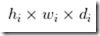
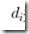
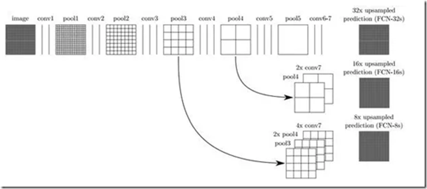
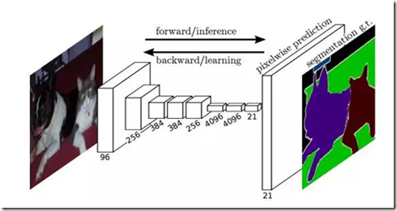

### 1.FCN

FCN 的思想很直观，即直接进行像素级别端到端（end-to-end）的语义分割，它可以基于主流的深度卷积神经网络模型（CNN）来实现。正所谓‘全卷积神经网络‘，在FCN中，传统的全连接层 fc6 和 fc7 均是由卷积层实现，而最后的 fc8 层则被替代为一个 **21 通道**（channel）的 1x1 卷积层，作为网络的最终输出。之所以有 21 个通道是因为 PASCAL VOC 的数据中包含 21 个类别（20个「object」类别和一个「background」类别）

下图为 FCN 的网络结构，若原图为 H×W×3，在经过若干堆叠的卷积和池化层操作后可以得到原图对应的响应张量（Activation tensor） ，其中， 为 i 第 层的通道数。可以发现，**由于池化层的下采样作用，使得响应张量的长和宽远小于原图的长和宽，这便给像素级别的直接训练带来问题**。

为了解决下采样带来的问题，**FCN 利用双线性插值将响应张量的长宽上采样到原图大小**，另外为了更好的预测图像中的细节部分，**FCN 还将网络中浅层的响应也考虑进来**。具体来说，就是将 Pool4 和 Pool3 的响应也拿来，分别作为模型 FCN-16s 和 FCN-8s 的输出，与原来 FCN-32s 的输出结合在一起做最终的语义分割预测（如下图所示）。

**影响语言分割的像素精度的主要原因是池化层的下采样操作**，由下图可以看出FCN-32s使用FCN 的最后一层卷积和池化的输出，该模型的下采样倍数最高，其对应的语义分割结果最为粗略；而 FCN-8s 则因下采样倍数较小可以取得较为精细的分割结果。

### 2.deeplab v3+相比于deeplab v2的区别在于什么

deeplab v2也是基于encoder和decoder架构的，但是后面有连接CRF条件随机场，而deeplab v3+没有了条件随机场，deeplab v3+的亮点之处在于引入了ASPP空洞卷积模块和同步的BN

