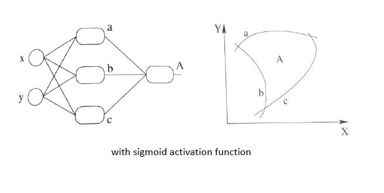

[TOC]

### 1.介绍Faster RCNN的流程及损失函数，为什么这样设计损失函数


**流程**

* Backbone。先通过主干网络提取特征图
* Region Proposal Networks。在通过RPN网络判断anchors属于前景还是背景，这里RPN网络包括两个部分，Anchor的生成和两层的卷积层
* Roi Ailing。该层收集输入的feature maps和proposals，综合这些信息后提取proposal feature maps，送入后续全连接层判定目标类别。
* Classification。利用proposal feature maps计算proposal的类别，同时再次bounding box regression获得检测框最终的精确位置。

**损失函数**

* Smooth L1 Loss（边框回归损失）

  融合L2损失：f(x)=x^2 ，L1损失：f(x)=|x|，构造成分段函数。

  L2损失对于比较大的误差的惩罚很高

  L1损失在0点处导数不存在，因此可能会影响收敛

  

* Cross Entropy Loss（分类损失）

### 2.介绍YOLO的流程

* 将图片Resize成448\*448，图片分割得到7\*7网格(cell)

* CNN提取特征和预测：卷积负责提特征。全链接负责预测：

  **a**) 7\*7\*2=98个bounding box(bbox) 的坐标![[公式]](https://www.zhihu.com/equation?tex=x_%7Bcenter%7D%2Cy_%7Bcenter%7D%2Cw%2Ch) 和是否有物体的confidence 。 

  **b)** 7\*7=49个cell所属20个物体的概率。

* 过滤bbox（通过nms）

### 3.说一说常见的正则化手段，L1和L2正则化的不同

L1最小绝对偏差

L2最小二乘误差 

L2对大数，对异常值更敏感

### 4.说一下交叉熵损失函数，什么是交叉熵

二分类

![[公式]](image/equation.svg)

其中：
- y——表示样本的label，正类为1，负类为0
- p——表示样本预测为正的概率

多分类

![[公式]](image/equation-1565940522253.svg)

其中：

- ![[公式]](image/equation-1565940508633.svg) ——类别的数量；
- ![[公式]](image/equation-1565940508639.svg) ——指示变量（0或1）,如果该类别和样本的类别相同就是1，否则是0；
- ![[公式]](image/equation-1565940508639.svg) ——对于观测样本属于类别 ![[公式]](image/equation-1565940508745.svg) 的预测概率。

### 5.CNN为什么要做卷积，为什么要有步长，为什么不用全连接层，它的反向传播是什么？

* 卷积就是一个滤波器，可调整的**滤波器**是 CNN 的**“卷积”**那部分；如何**调整滤波器**则是 CNN 的**“神经网络”**那部分。

* 步长小，提取的特征会更全面，不会遗漏太多信息。但同时可能造成计算量增大，甚至过拟合等问题。步长大，计算量会下降，但很有可能错失一些有用的特征。

* 全连接层（fully connected layers，FC）在整个卷积神经网络中起到“分类器”的作用。如果说卷积层、池化层和激活函数层等操作是将原始数据映射到**特征空间**的话，全连接层则起到将学到的“分布式特征表示”映射到**样本标记空间**的作用

### 6.给一张散点图，怎么做方差最大回归

### 7.怎么处理样本的不均衡，尤其是各个图像检测模型中

* OHEM（online hard example mining）在线困难样本挖掘

  OHEM算法，它在训练过程中自动选择困难样本，其核心思想是根据输入样本的损失值进行筛选，筛选出困难样本，然后将筛选得到的这些样本应用在SGD中。

* Focal Loss

  Focal loss主要是为了解决one-stage目标检测中正负样本比例严重失衡的问题。

### 8.过拟合怎么解决

* Early stopping
* 数据集扩增  有时候往往拥有更多的数据胜过一个好的模型

* 正则化方法

### 9.deeplab，CRF后处理的目的

CRF-条件随机场，利用crf修饰分割所得的图像边缘，CRF是后处理，是不参与训练的，在测试的时候对feature map做完CRF后，再双线性插值resize到原图尺寸

### 10.批归一化（Batch Normalization）

BN在深层神经网络的作用非常明显：若神经网络训练时遇到收敛速度较慢，或者“梯度爆炸”等无法训练的情况发生时都可以尝试用BN来解决。同时，常规使用情况下同样可以加入BN来加速模型训练，甚至提升模型精度。

BN 是一种**正则化**方法（减少泛化误差），主要作用有：

- **加速网络的训练**（缓解梯度消失，支持更大的学习率）
- **防止过拟合**
- 降低了**参数初始化**的要求。

### 11.多标签分类怎么解决，从损失函数角度考虑

### 12.俩个问题，怎么检测过拟合，怎么减少过拟合

* 交叉验证目的：

  选出最优参数的模型。模型建立后，调参数是个很费时的过程，通过交叉验证我们可以得出最优参数的模型。 
  1.1 准备候选模型，M1，M2，M3，……（模型框架一致，只是参数不同） 
  1.2 对于每个模型，分别进行交叉验证，返回该模型的准确率或者错误率等信息（自己选择是计算accuracy还是error），其返回应该是交叉验证后得出的均值。 
  1.3 通过比较不同模型的accuracy或error，选择最佳模型。

* 交叉验证分类：

  留P验证（Leave-p-out Cross Validation)、k-fold交叉验证（K-fold Cross Validation）等。 
  2.1 留p验证（LpO CV）是指训练集上随机选择p个样本作为测试集，其余作为子训练集。时间复杂度为CpNCNp，是阶乘的复杂度，不可取。 
  2.2 k-fold交叉验证就是将数据集平均分割成k份，依次选择一份作为测试集，其余作为子训练集，最后将得到的k个accuracy取平均。通常K取10，也就是经常听到的10折交叉验证。

### 13.Focal loss 

**交叉熵**

![[公式]](image/equation-1565940522253.svg)

**Softmax** (**归一化指数函数**)

![[公式]](J:\Main Project\Computer-Vison\MyNote\image\equation-1589354991885.svg)

**Sigmoid**

![[公式]](J:\Main Project\Computer-Vison\MyNote\image\equation-1589355026514.svg)

Focal loss主要是为了解决one-stage目标检测中正负样本比例严重失衡的问题。该损失函数降低了大量简单负样本在训练中所占的权重，也可理解为一种困难样本挖掘。

Focal loss是在交叉熵损失函数基础上进行的修改


其中gamma>0使得减少易分类样本的损失。使得更关注于困难的、错分的样本。

平衡因子alpha，用来平衡正负样本本身的比例不均：文中alpha取0.25，即正样本要比负样本占比小，这是因为负例易分。


只添加alpha虽然可以平衡正负样本的重要性，但是无法解决简单与困难样本的问题。

gamma调节简单样本权重降低的速率，当gamma为0时即为交叉熵损失函数，当gamma增加时，调整因子的影响也在增加。实验发现gamma为2是最优。

### 14.反向传播算法

误差反向传播

反向传播算法（BP 算法）主要由两个阶段组成：激励传播与权重更新。

**第1阶段：激励传播**

每次迭代中的传播环节包含两步：

1. （前向传播阶段）将训练输入送入网络以获得激励响应；
2. （反向传播阶段）将激励响应同训练输入对应的目标输出求差，从而获得输出层和隐藏层的响应误差。

**第2阶段：权重更新**

对于每个突触上的权重，按照以下步骤进行更新：

1. 将输入激励和响应误差相乘，从而获得权重的梯度；
2. 将这个梯度乘上一个比例并取反后加到权重上。

这个比例（百分比）将会影响到训练过程的速度和效果，因此成为“训练因子”。梯度的方向指明了误差扩大的方向，因此在更新权重的时候需要对其取反，从而减小权重引起的误差。

第 1 和第 2 阶段可以反复循环迭代，直到网络对输入的响应达到满意的预定的目标范围为止。

### 15.如何解决训练样本少的问题

1.利用预训练模型进行迁移微调（fine-tuning），预训练模型通常在特征上拥有很好的语义表达。

2.单样本或者少样本学习（one-shot，few-shot learning），这种方式适用于样本类别远远大于样本数量的情况等极端数据集。例如有 1000 个类别，每个类别只提供 1-5 个样本。少样本学习同样也需要借助预训练模型，但有别于微调的在于，微调通常仍然在学习不同类别的语义，而少样本学习通常需要学习样本之间的距离度量。例如孪生网络（Siamese Neural Networks）就是通过训练两个同种结构的网络来判别输入的两张图片是否属于同一类。

### 16.对 fine-tuning (微调模型的理解)，为什么要修改最后几层神经网络权值？

1.CNN 中更靠近底部的层（定义模型时先添加到模型中的层）编码的是更加通用的可复用特征，而更靠近顶部的层（最后添加到模型中的层）编码的是更专业业化的特征。微调这些更专业化的特征更加有用，它更代表了新数据集上的有用特征。 

2.训练的参数越多，过拟合的风险越大。很多 SOTA 模型拥有超过千万的参数，在一个不大的数据集上训练这么多参数是有过拟合风险的，除非你的数据集像 Imagenet 那样大。

### 17.线性因素和非线性因素各指什么（映射方式）

线性1+1=2 **齐次性**和**可加性**

非线性1+1不等于2

### 18.为什么要有激活函数

无激活函数


有激活函数




### 19.t-SNE算法


### 20.两分布间距离的度量：MMD、KL散度、Wasserstein 对比

都可以衡量两个样本之间的差异，KL散度度量的不是距离，而是一种信息损失。最大均值差异（Maximum mean discrepancy，MMD），度量在再生希尔伯特空间中两个分布的距离，是一种核学习方法（先经过一个函数的变换）

### 21.FPN的结构

特征金字塔 顶层特征通过上采样和低层特征做融合，而且每层都是独立预测的（足够低层的特征对于检测小物体是很有帮助的）


算法大致结构如下：**一个自底向上的线路，一个自顶向下的线路，横向连接（lateral connection）**。图中放大的区域就是横向连接，这里1*1的卷积核的主要作用是减少卷积核的个数，也就是减少了feature map的个数，并不改变feature map的尺寸大小。

### 22.NMS SoftNMS

```
NMS
```

**算法逻辑:**
输入: nn 行 44 列的候选框数组, 以及对应的 nn 行 11 列的置信度数组.
输出: mm 行 44 列的候选框数组, 以及对应的 mm 行 11 列的置信度数组, mm 对应的是去重后的候选框数量
算法流程:

1. 计算 nn 个候选框的面积大小
2. 对置信度进行排序, 获取排序后的下标序号, 即采用`argsort`
3. 将当前置信度最大的框加入返回值列表中
4. 获取当前置信度最大的候选框与其他任意候选框的相交面积
5. 利用相交的面积和两个框自身的面积计算框的交并比, 将交并比大于阈值的框删除.
6. 对剩余的框重复以上过程

```
import cv2
import numpy as np

def nms(bounding_boxes, confidence_score, threshold):
    if len(bounding_boxes) == 0:
        return [], []
    bboxes = np.array(bounding_boxes)
    score = np.array(confidence_score)

    # 计算 n 个候选框的面积大小
    x1 = bboxes[:, 0]
    y1 = bboxes[:, 1]
    x2 = bboxes[:, 2]
    y2 = bboxes[:, 3]
    areas =(x2 - x1 + 1) * (y2 - y1 + 1)

    # 对置信度进行排序, 获取排序后的下标序号, argsort 默认从小到大排序
    order = np.argsort(score)

    picked_boxes = [] # 返回值
    picked_score = [] # 返回值
    while order.size > 0:
        # 将当前置信度最大的框加入返回值列表中
        index = order[-1]
        picked_boxes.append(bounding_boxes[index])
        picked_score.append(confidence_score[index])

        # 获取当前置信度最大的候选框与其他任意候选框的相交面积
        x11 = np.maximum(x1[index], x1[order[:-1]])
        y11 = np.maximum(y1[index], y1[order[:-1]])
        x22 = np.minimum(x2[index], x2[order[:-1]])
        y22 = np.minimum(y2[index], y2[order[:-1]])
        w = np.maximum(0.0, x22 - x11 + 1)
        h = np.maximum(0.0, y22 - y11 + 1)
        intersection = w * h

        # 利用相交的面积和两个框自身的面积计算框的交并比, 将交并比大于阈值的框删除
        ratio = intersection / (areas[index] + areas[order[:-1]] - intersection)
        left = np.where(ratio < threshold)
        order = order[left]

    return picked_boxes, picked_score
```


```
Soft-NMS
```

**算法逻辑:**
输入:

- bboxes: 坐标矩阵, 每个边框表示为 [x1, y1, x2, y2]
- scores: 每个 box 对应的分数, 在 Soft-NMS 中, scores 会发生变化(**对外部变量也有影响**)
- iou_thresh: 交并比的最低阈值
- sigma2: 使用 gaussian 函数的方差, sigma2 代表 σ2σ2
- score_thresh: 最终分数的最低阈值
- method: 使用的惩罚方法, 1 代表线性惩罚, 2 代表高斯惩罚, 其他情况代表默认的 NMS

返回值: 最终留下的 boxes 的 index, 同时, scores 值也已经被改变.
算法流程:

1. 在 bboxes 之后添加对于的下标[0, 1, 2…], 最终 bboxes 的 shape 为 [n, 5], 前四个为坐标, 后一个为下标
2. 计算每个 box 自身的面积
3. **对于每一个下标 ii**, 找出 i 后面的最大 score 及其下标, 如果当前 i 的得分小于后面的最大 score, 则与之交换, 确保 i 上的 score 最大.
4. 计算 IoU
5. 根据用户选定的方法更新 scores 的值
6. 以上过程循环 NN 次后(NN 为总边框的数量), 将最终得分大于最低阈值的下标返回, 根据下标获取最终存留的 Boxes, **注意, 此时, 外部 scores 的值已经完成更新, 无需借助下标来获取.**


```
import numpy as np

def soft_nms(bboxes, scores, iou_thresh=0.3, sigma2=0.5, score_thresh=0.001, method=2):
    # 在 bboxes 之后添加对于的下标[0, 1, 2...], 最终 bboxes 的 shape 为 [n, 5], 前四个为坐标, 后一个为下标
    N = bboxes.shape[0] # 总的 box 的数量
    indexes = np.array([np.arange(N)])  # 下标: 0, 1, 2, ..., n-1
    bboxes = np.concatenate((bboxes, indexes.T), axis=1) # concatenate 之后, bboxes 的操作不会对外部变量产生影响

    # 计算每个 box 的面积
    x1 = bboxes[:, 0]
    y1 = bboxes[:, 1]
    x2 = bboxes[:, 2]
    y2 = bboxes[:, 3]
    areas = (x2 - x1 + 1) * (y2 - y1 + 1)

    for i in range(N):
        # 找出 i 后面的最大 score 及其下标
        pos = i + 1
        if i != N-1:
            maxscore = np.max(scores[pos:], axis=0)
            maxpos = np.argmax(scores[pos:], axis=0)
        else:
            maxscore = scores[-1]
            maxpos = 0

        # 如果当前 i 的得分小于后面的最大 score, 则与之交换, 确保 i 上的 score 最大
        if scores[i] < maxscore:
            bboxes[[i, maxpos + i + 1]] = bboxes[[maxpos + i + 1, i]]
            scores[[i, maxpos + i + 1]] = scores[[maxpos + i + 1, i]]
            areas[[i, maxpos + i + 1]] = areas[[maxpos + i + 1, i]]

        # IoU calculate
        xx1 = np.maximum(bboxes[i, 0], bboxes[pos:, 0])
        yy1 = np.maximum(bboxes[i, 1], bboxes[pos:, 1])
        xx2 = np.minimum(bboxes[i, 2], bboxes[pos:, 2])
        yy2 = np.minimum(bboxes[i, 3], bboxes[pos:, 3])
        w = np.maximum(0.0, xx2 - xx1 + 1)
        h = np.maximum(0.0, yy2 - yy1 + 1)
        intersection = w * h
        iou = intersection / (areas[i] + areas[pos:] - intersection)

        # Three methods: 1.linear 2.gaussian 3.original NMS
        if method == 1:  # linear
            weight = np.ones(iou.shape)
            weight[iou > iou_thresh] = weight[iou > iou_thresh] - iou[iou > iou_thresh]
        elif method == 2:  # gaussian
            weight = np.exp(-(iou * iou) / sigma2)
        else:  # original NMS
            weight = np.ones(iou.shape)
            weight[iou > iou_thresh] = 0

        scores[pos:] = weight * scores[pos:]

    # select the boxes and keep the corresponding indexes
    inds = bboxes[:, 4][scores > score_thresh]
    keep = inds.astype(int)
    return keep

# boxes and scores
boxes = np.array([[200, 200, 400, 400], [220, 220, 420, 420],
                  [240, 200, 440, 400], [200, 240, 400, 440],
                  [1, 1, 2, 2]], dtype=np.float32)
boxscores = np.array([0.9, 0.8, 0.7, 0.6, 0.5], dtype=np.float32)
index = soft_nms(boxes, boxscores, method=2)
print(index) # 按照 scores 的排序指明了对应的 box 的下标
print(boxes[index])
print(boxscores) # 注意, scores 不需要用 index 获取, scores 已经是更新过的排序 scores
```


### 23.RCNN系列模型的区别


### 24.ArcFace Loss

利用margin来扩大不同类之间距离的损失函数

ArchFace中是直接在角度空间（angular space）中最大化分类界限，而CosineFace是在余弦空间中最大化分类界限

![[公式]](J:\Main Project\Computer-Vison\MyNote\image\equation-1589457396643.svg)