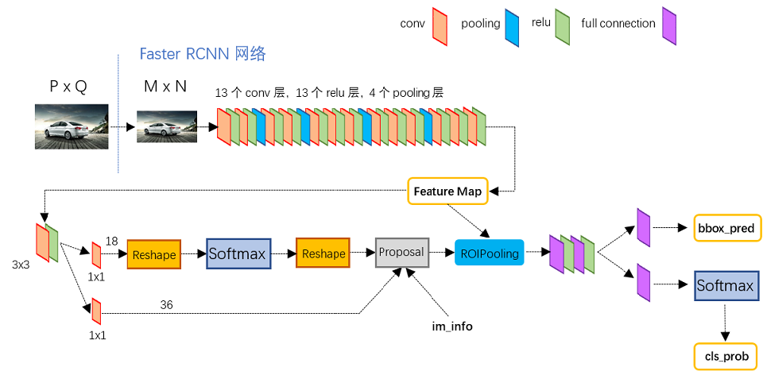
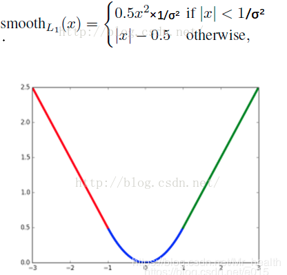

[TOC]

## 1.介绍Faster RCNN的流程及损失函数，为什么这样设计损失函数

**流程**

* Backbone。先通过主干网络提取特征图
* Region Proposal Networks。在通过RPN网络判断anchors属于前景还是背景，这里RPN网络包括两个部分，Anchor的生成和两层的卷积层
* Roi Ailing。该层收集输入的feature maps和proposals，综合这些信息后提取proposal feature maps，送入后续全连接层判定目标类别。
* Classification。利用proposal feature maps计算proposal的类别，同时再次bounding box regression获得检测框最终的精确位置。

**损失函数**

* Smooth L1 Loss（边框回归损失）

  融合L2损失：f(x)=x^2 ，L1损失：f(x)=|x|，构造成分段函数。

  L2损失对于比较大的误差的惩罚很高

  L1损失在0点处导数不存在，因此可能会影响收敛

  

* Cross Entropy Loss（分类损失）

## 2.介绍YOLO的流程

* 将图片Resize成448\*448，图片分割得到7\*7网格(cell)

* CNN提取特征和预测：卷积负责提特征。全链接负责预测：

  **a**) 7\*7\*2=98个bounding box(bbox) 的坐标![[公式]](https://www.zhihu.com/equation?tex=x_%7Bcenter%7D%2Cy_%7Bcenter%7D%2Cw%2Ch) 和是否有物体的confidence 。 

  **b)** 7\*7=49个cell所属20个物体的概率。

* 过滤bbox（通过nms）

## 3.说一说常见的正则化手段，L1和L2正则化的不同

L1最小绝对偏差

L2最小二乘误差 

L2对大数，对异常值更敏感

## 4.说一下交叉熵损失函数，什么是交叉熵

二分类

![[公式]](image/equation.svg)

其中：
- y——表示样本的label，正类为1，负类为0
- p——表示样本预测为正的概率

多分类

![[公式]](image/equation-1565940522253.svg)

其中：

- ![[公式]](image/equation-1565940508633.svg) ——类别的数量；
- ![[公式]](image/equation-1565940508639.svg) ——指示变量（0或1）,如果该类别和样本的类别相同就是1，否则是0；
- ![[公式]](image/equation-1565940508639.svg) ——对于观测样本属于类别 ![[公式]](image/equation-1565940508745.svg) 的预测概率。

### 5.CNN为什么要做卷积，为什么要有步长，为什么不用全连接层，它的反向传播是什么？

* 卷积就是一个滤波器，可调整的**滤波器**是 CNN 的**“卷积”**那部分；如何**调整滤波器**则是 CNN 的**“神经网络”**那部分。

* 步长小，提取的特征会更全面，不会遗漏太多信息。但同时可能造成计算量增大，甚至过拟合等问题。步长大，计算量会下降，但很有可能错失一些有用的特征。

* 全连接层（fully connected layers，FC）在整个卷积神经网络中起到“分类器”的作用。如果说卷积层、池化层和激活函数层等操作是将原始数据映射到**特征空间**的话，全连接层则起到将学到的“分布式特征表示”映射到**样本标记空间**的作用

### 6.给一张散点图，怎么做方差最大回归

### 7.怎么处理样本的不均衡，尤其是各个图像检测模型中

* OHEM（online hard example mining）在线困难样本挖掘

  OHEM算法，它在训练过程中自动选择困难样本，其核心思想是根据输入样本的损失值进行筛选，筛选出困难样本，然后将筛选得到的这些样本应用在SGD中。

* Focal Loss

  Focal loss主要是为了解决one-stage目标检测中正负样本比例严重失衡的问题。

### 8.过拟合怎么解决

* Early stopping
* 数据集扩增  有时候往往拥有更多的数据胜过一个好的模型

* 正则化方法

### 9.CRF后处理的目的

