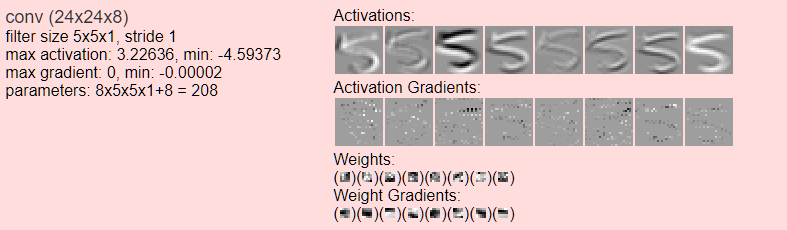

# 卷积神经网络可视化

## 1.可视化工具

[3D Visualization of a Convolutional Neural Network](http://scs.ryerson.ca/~aharley/vis/conv/)

[2D Visualization of a Convolutional Neural Network](http://scs.ryerson.ca/~aharley/vis/conv/flat.html)

[ConvNetJS: Deep Learning in your browser](https://cs.stanford.edu/people/karpathy/convnetjs/)

[Deep Visualization](https://zhuanlan.zhihu.com/p/24833574)    [Github](https://github.com/yosinski/deep-visualization-toolbox)

[Tensorspace](https://tensorspace.org/)

[CNNVis](http://shixialiu.com/publications/cnnvis/demo/)

### 2.可视化例子

[Visual Interpretability for Convolutional Neural Networks](https://towardsdatascience.com/visual-interpretability-for-convolutional-neural-networks-2453856210ce)

[cs231n-understanding-cnn](http://cs231n.github.io/understanding-cnn/)

[Deepvis](http://yosinski.com/deepvis)

### 3.可视化文献

[CVPR2019_Explainable_AI](http://openaccess.thecvf.com/CVPR2019_workshops/CVPR2019_Explainable_AI.py)

[ACTIVIS](https://arxiv.org/pdf/1704.01942)

* Facebook 研发的交互式深度学习可视化系统，可以对生产环境中的大规模模型以及器运行的结果进行生动直观的呈现

[Grad-CAM](https://arxiv.org/pdf/1610.02391)

* http://gradcam.cloudcv.org/

[Grad-CAM++](https://arxiv.org/pdf/1710.11063)

[深度学习的可解释性研究（一）—— 让模型具备说人话的能力](https://zhuanlan.zhihu.com/p/37223341)

[深度学习的可解释性研究（二）——不如打开箱子看一看](https://zhuanlan.zhihu.com/p/38151985)

## 4.可视化内容

* 激活函数
* 激活函数梯度
* 卷积权重
* 卷积权重梯度
* 卷积参数量
* 全连接层

### 5.高维数据可视化之t-SNE算法（T 分布随机近邻嵌入算法）

当构建一个预测模型时，第一步一般都需要理解数据。虽然搜索原始数据并计算一些基本的统计学数字特征有助于理解它，但没有什么是可以和图表可视化展示更为直观的。然而将高维数据拟合到一张简单的图表（降维）通常是非常困难的，这就正是 t-SNE 发挥作用的地方。

### 6.总结

熟悉CNN的都知道，在训练的过程中，CNN中不同的Feature Map经常能学习到不同的具象元素，例如某个Feature Map能识别到眼睛，某个能识别到花朵等等。如我们所知，不同的Feature Map是由不同的神经元控制的。从这个角度来看，在深度神经网络中，某种事物的表征，是由某个特定的神经元决定的。

无独有偶，我们人脑的神经元也有类似的机理，有时候脑中的某个神经元也表现为对某个特定事物敏感，这就是生物医学领域的“祖母神经元理论”。然而对于这个理论，很多学者并不认可，在他们看来，对特定事物产生敏感的并不是单个神经元，而是一个神经元集簇！

巧合的是，深度学习领域也有许多学者认为：在深度神经网络中，能够表达特定事物的并不是单个神经元，而是一个向量空间！

