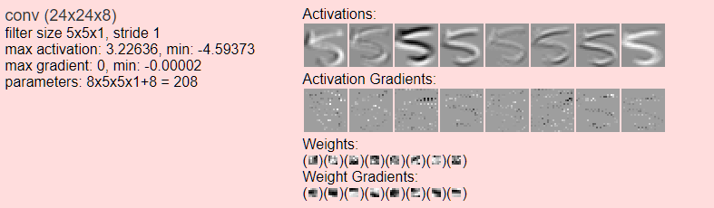
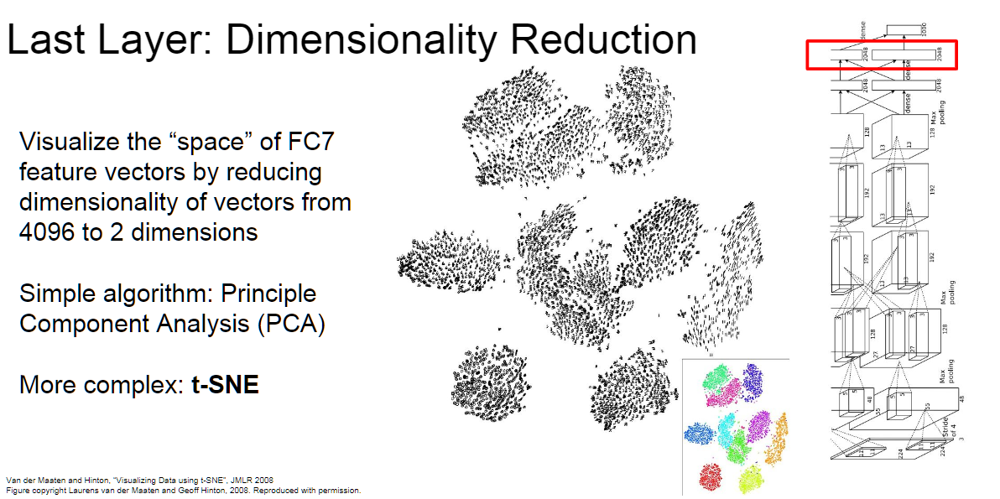

# 神经网络可视化

## 1.可视化工具

[3D Visualization of a Convolutional Neural Network](http://scs.ryerson.ca/~aharley/vis/conv/)

[2D Visualization of a Convolutional Neural Network](http://scs.ryerson.ca/~aharley/vis/conv/flat.html)

[ConvNetJS: Deep Learning in your browser](https://cs.stanford.edu/people/karpathy/convnetjs/)

[Deep Visualization](https://zhuanlan.zhihu.com/p/24833574)

## 2.可视化内容

* 激活函数
* 激活函数梯度
* 卷积权重
* 卷积权重梯度
* 卷积参数量
* 全连接层

## 3.可视化如何帮助调参与网络设计

