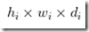

# 目标检测

## YOLO系列

### YOLO v4

- Weighted-Residual-Connections (WRC)
- Cross-Stage-Partial-connections (CSP)
- Cross mini-Batch Normalization (CmBN)
- Self-adversarial-training (SAT)
- Mish-activation
- Mosaic data augmentation
- CmBN
  - CBN的一个变体，CBN统计多个迭代步的数据然后做一次BN参数的更新，而因为Mosaic数据增广的使用，可以在空间上按照输入图片的划分来划分特征图，然后把它们视为四个mini-batch的数据来统计均值和方差，有效解决了BN本身对BatchSize大小的要求。
- DropBlock regularization
- CIoU loss

# 数据增强

- Mixup：将随机的两张样本按比例混合，分类的结果按比例分配；
- Cutout：随机的将样本中的部分区域cut掉，并且填充0像素值，分类的结果不变；
- CutMix：就是将一部分区域cut掉但不填充0像素而是随机填充训练集中的其他数据的区域像素值，分类结果按一定的比例分配
- Mosaic：将四张图片随机缩放后拼接在一起构成一张训练的图片
- Color Jittering：对颜色的数据增强：图像亮度、饱和度、对比度变化
- Random Scale：尺度变换
- Random Crop：采用随机图像差值方式，对图像进行裁剪、缩放
- Horizontal/Vertical Flip：水平/垂直翻转
- Shift：平移变换
- Rotation/Reflection：旋转/仿射变换

# 网络结构

## FPN的结构

特征金字塔网络 Feature Pyramid Networks

**顶层特征通过上采样（最近邻插值）和底层特征做融合**，而且每层都是独立预测的（足够底层的特征对于检测小物体是很有帮助的）


**算法大致结构**

**一个自底向上的线路，一个自顶向下的线路，横向连接（lateral connection）**。图中放大的区域就是横向连接，这里1*1的卷积核的主要作用是减少卷积核的个数，也就是减少了feature map的个数，并不改变feature map的尺寸大小。

**基于FPN的RPN是怎么训练的**

在FPN的每个融合后特征图的每一层上都接一个RPN子网（3*3卷积和2个并列的1\*1卷积），确定RPN子网的正负anchor box样本，再计算各预测层上RPN的anchor box分类和回归损失。

# 正则化方法

## DropBlock

dropout 通常对全连接层很有效，对卷积层效果甚微。


图1：（b）（c）中绿色区域主要蕴含了图像的语义信息，也就是狗所在的主要区域，通过图b的方式随机dropout效果并不好，因为相邻单元也包含了相关信息。按照图C的方式，移除整块区域，例如整个头或者脚，这样可以强制剩余单元学习到用于分类的特征。

## Dropout

在前向传播的时候，让某个神经元的激活值以一定的概率p停止工作，这样可以使模型泛化性更强，因为它不会太依赖某些局部的特征

**（1）取平均的作用**

dropout掉不同的隐藏神经元就类似在训练不同的网络，随机删掉一半隐藏神经元导致网络结构已经不同，整个dropout过程就相当于对很多个不同的神经网络取平均。

训练很多不同的网络，效果类似于embeding。

**（2）减少神经元之间的过度依赖**

迫使网络去学习更加**鲁棒的特征**


## 其他Dropout方法


## Batch Normalization

BN在深层神经网络的作用非常明显：若神经网络训练时遇到收敛速度较慢，或者“梯度爆炸”等无法训练的情况发生时都可以尝试用BN来解决。同时，常规使用情况下同样可以加入BN来加速模型训练，甚至提升模型精度。

BN 是一种**正则化**方法（减少泛化误差），主要作用有：

- **加速网络的训练**（缓解梯度消失，支持更大的学习率）
- **防止过拟合**
- 降低了**参数初始化**的要求。


# 激活函数

## ReLu


## Leaky ReLU


## Mish-Activation

`Mish=x * tanh(ln(1+e^x)) `


# 损失函数

## 1.Dice Loss 医学影像分割

# 语义分割

## 1.FCN

FCN 的思想很直观，即直接进行像素级别端到端（end-to-end）的语义分割，它可以基于主流的深度卷积神经网络模型（CNN）来实现。正所谓‘全卷积神经网络‘，在FCN中，传统的全连接层 fc6 和 fc7 均是由卷积层实现，而最后的 fc8 层则被替代为一个 **21 通道**（channel）的 1x1 卷积层，作为网络的最终输出。之所以有 21 个通道是因为 PASCAL VOC 的数据中包含 21 个类别（20个「object」类别和一个「background」类别）


下图为 FCN 的网络结构，若原图为 H×W×3，在经过若干堆叠的卷积和池化层操作后可以得到原图对应的响应张量（Activation tensor）[](http://images2015.cnblogs.com/blog/1139079/201706/1139079-20170621162543570-1328652783.png) ，其中，[](http://images2015.cnblogs.com/blog/1139079/201706/1139079-20170621162544585-1672214780.png) 为 i 第 层的通道数。可以发现，**由于池化层的下采样作用，使得响应张量的长和宽远小于原图的长和宽，这便给像素级别的直接训练带来问题**。


为了解决下采样带来的问题，**FCN 利用双线性插值将响应张量的长宽上采样到原图大小**，另外为了更好的预测图像中的细节部分，**FCN 还将网络中浅层的响应也考虑进来**。具体来说，就是将 Pool4 和 Pool3 的响应也拿来，分别作为模型 FCN-16s 和 FCN-8s 的输出，与原来 FCN-32s 的输出结合在一起做最终的语义分割预测（如下图所示）。


**影响语言分割的像素精度的主要原因是池化层的下采样操作**，由下图可以看出FCN-32s使用FCN 的最后一层卷积和池化的输出，该模型的下采样倍数最高，其对应的语义分割结果最为粗略；而 FCN-8s 则因下采样倍数较小可以取得较为精细的分割结果。


## 2.deeplab v3+相比于deeplab v2的区别在于什么

deeplab v2也是基于encoder和decoder架构的，但是后面有连接CRF条件随机场，而deeplab v3+没有了条件随机场，deeplab v3+的亮点之处在于引入了ASPP空洞卷积模块和同步的BN

## 3.deeplab v3+损失函数CrossEntropyLoss

如果是做语义分割任务是得到一张【h,w】的语义图，那么input=【n,c,h,w】target=【n,h,w】

pytorch 损失函数需要把标签为255的忽略，有些数据集标注有白色描边（VOC 2012），不代表任何实际类别

```
nn.CrossEntropyLoss(ignore_index=255, reduction='mean')
```

## 4.实时语义分割

实时性语义分割算法进行了总结，发现当前主要有三种加速方法：1) 通过 Crop 或者 Resize 限制输入图片进而减少计算量；2) 减少网络通道数，尤其是 Early Stage；3) 还有像 ENet 类似的方法直接丢掉最后一个 Stage，如图10(a)所示。

# 域自适应

## 1.KL散度

KL 散度是一种衡量两个分布（比如两条线）之间的匹配程度的方法