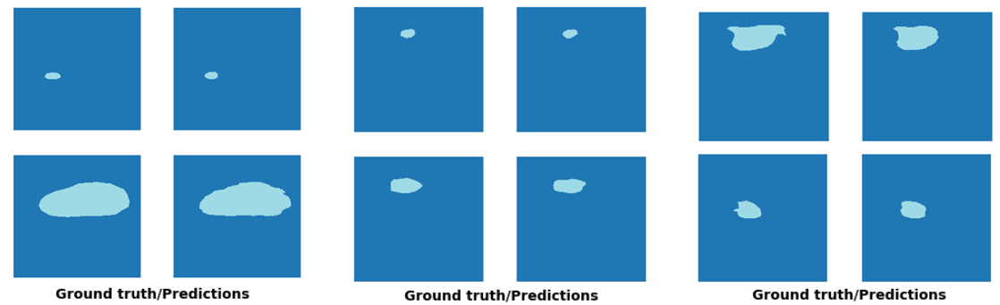
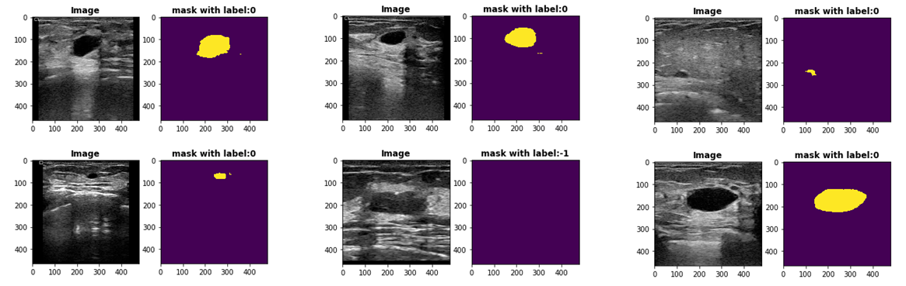
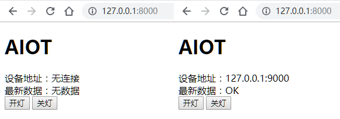
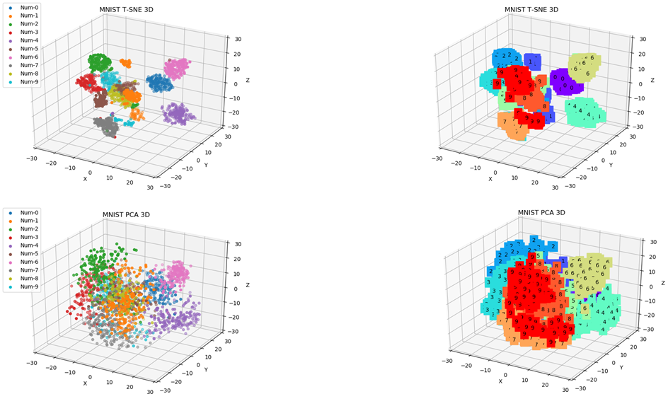

# Computer-Vison

### 项目

* Dynamic U-Net-Segment 

  * ResNet34 + Unet 在小的数据集上效果不错。
  * 小的数据集选择参数量小的网络，减小通道数与层数，减弱正则化，迭代次数不能太大。网络太硬影响收敛速度，网络软一点效果好。
  * Adam采用自适应学习率模型收敛较快，但最终模型变现不如SGD。
  
  
  
* DeeplabV3+

  

* YOLO V4

* [AIOT](https://github.com/KeyForce/Computer-Vison/tree/master/AIOT/DEMO1)

  * 网页端实现开灯关灯

* Domain-Adaptation

  

### 其他

* [NoteBook](https://github.com/KeyForce/NoteBook)
* Leetcode

